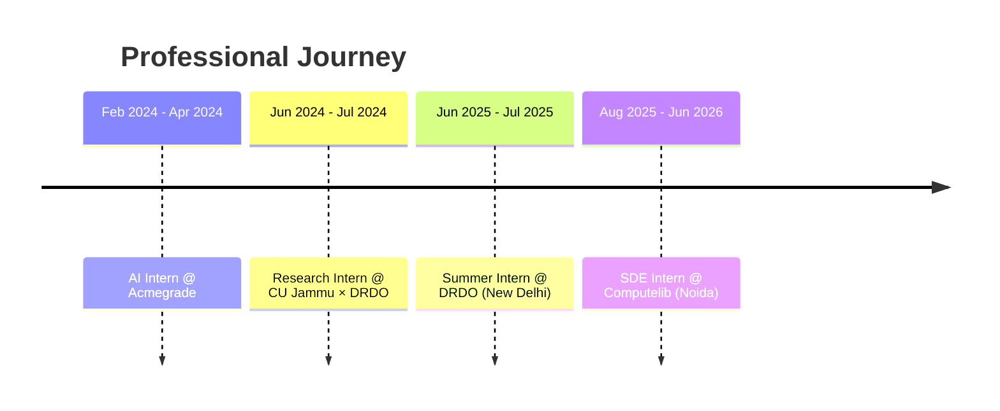

  

# 💻 Software Development Engineer

 

## 💡 About Me

I am a Software Development Engineer specializing in building robust backend architectures, scalable API ecosystems, machine learning pipelines, and advanced automation/RPA workflows. With hands-on engineering experience at **Computelib** and **DRDO**, I build end-to-end full-stack applications, customize LLM agents, integrate real-time WebSockets, and deploy database and vector search solutions.

> **Current Focus:** SDE Intern @ Computelib | Former Intern @ DRDO  
> **Philosophy:** *Build. Automate. Scale.*

---

## 🎓 Education

| Degree | Institution | Timeline | Score |
| :--- | :--- | :--- | :--- |
| 🎓 **B.Tech in Computer Science & Engineering** | Central University of Jammu | 2022 – 2026 | **9.36 / 10 CGPA** |
| 🏫 **Senior Secondary (Class XII)** | CBSE | 2021 | **95.0%** |
| 🏫 **Secondary (Class X)** | CBSE | 2019 | **94.8%** |

## 🛠️ Technical Skills

### 💻 Programming Languages

  

> **Core Theory:** Data Structures & Algorithms (DSA) • Object-Oriented Programming (OOP) • Operating Systems (OS) • Database Management Systems (DBMS) • Computer Networks (CN)

---

### 🌐 Backend & Web Development

  

> **Specialties:** WebSockets (Real-time APIs) • Browser Extensions • CLI Proxy APIs • Flask-RESTX • JWT Authentication • SQLAlchemy ORM • Pydantic Validation

---

### 🗄️ Databases & Vector Search

  

> **Vector DBs & Search:** Qdrant • ChromaDB • Vector Embeddings & Similarity Search • RAG (Retrieval-Augmented Generation)

---

### ⚙️ Automation, DevOps & Tools

  

> **Automation Systems:** n8n Workflow Automation • Ollama (Local LLM Integration) • Model Context Protocol (MCP) • BeautifulSoup4 • Ngrok & Cloudflare Tunnels • Cursor IDE

---

### 🧠 Artificial Intelligence & Machine Learning

  

> **AI Frameworks & Libraries:** YOLOv10 • HRNet • Mediapipe • Scikit-learn Pipelines • spaCy & NLTK (NLP) • Matplotlib

## 💼 Professional Experience

### 🚀 **SDE Intern** | Computelib (Noida)
_Aug 2025 – Jun 2026_

- **🛠️ Full-Stack Ownership:** Single-handedly designed, built, and shipped multiple end-to-end applications, independently managing backend, frontend, database design, testing, and debugging.
- **⚡ Backend Architectures:** Engineered scalable web APIs using **FastAPI**, **Flask**, **SQLAlchemy**, **Pydantic**, **PostgreSQL**, and **Qdrant**.
- **🤖 AI & Automation:** Integrated workflows using **n8n**, **Ollama**, and **MCP (Model Context Protocol)** to boost productivity.
- **🔌 Real-time Systems:** Leveraged **WebSockets** for high-frequency, real-time messaging on React apps.
- **📦 Product Integration:** Developed customized **Browser Extensions** and **CLI Proxy APIs** for larger product pipelines, and deployed an embedded app on a major e-commerce platform.

---

### 🛰️ **Summer Intern** | DRDO (New Delhi)
_Jun 2025 – Jul 2025_

- **⚡ Automated Pipelines:** Built automated scraping and ingestion pipelines using **Selenium**, **Playwright**, and direct API integrations.
- **🧠 NLP & Text Mining:** Developed scripts for sentiment analysis, content classification, and automated report generation using **spaCy** and **NLTK**.
- **📊 Workflows & Verification:** Implemented Python-based workflows for web scraping and data verification focused on speed and reliability.

---

### 🧪 **Research Intern** | Central University of Jammu × DRDO
_Jun 2024 – Jul 2024_

- **👁️ Computer Vision Systems:** Designed Machine Learning and CV components using **VGG16**, **K-Means**, and **OpenCV** for real-time edge device integration.
- **🔌 IoT Pipelines:** Built IoT-driven pipelines using **Raspberry Pi**, **Arduino**, sensors, and cameras to capture and process edge-level data.
- **💬 Alerts & Workflows:** Created real-time alerting and communication workflows using **Twilio** and SMS automation APIs.

---

### 🤖 **Artificial Intelligence Intern** | Acmegrade (Remote)
_Feb 2024 – Apr 2024_

- **🧠 Model Development:** Developed deep learning and ML models for classification and prediction tasks using **TensorFlow** and **Scikit-learn**.
- **📊 Data Pipelines:** Performed dataset preprocessing, feature engineering, image/data augmentation, and training optimization.

## 🚀 Projects

### 🥇 🤖 [GovSight AI](https://github.com/theashishmavii/GovSight-AI)
> **AI-Powered Government Portal RPA Platform**
>
> `FastAPI` • `React` • `Selenium` • `WebSockets` • `Google Gemini LLM` • `Python Multi-threading`
>
> - **High-Reliability Automation:** Automates data extraction from Indian government portals (UIDAI, India Post) using Natural Language commands.
> - **Advanced Captcha Bypass:** Employs a human-in-the-loop multi-threaded CAPTCHA bypass mechanism with threading events to pause/resume Selenium workers.
> - **Real-time Tracking:** Features a dynamic React dashboard showing live job status, progress, and logs connected via WebSockets.

---

### 🥇 🤖 [Lightweight DevinAI](https://github.com/theashishmavii/Lightweight-DevinAI)
> **Minimalist AI Software Engineer Agent Platform**
>
> `Flask` • `LangChain` • `Ollama` • `GitPython` • `SQLAlchemy` • `Tiktoken` • `Pytest` • `HTML/CSS/JS`
>
> - **Agent Execution:** Semi-autonomous coding agent that can read, write, edit, and test files using LLMs and tool execution.
> - **Features:** Simple web-based control panel, context/token management, and automated Git-based version tracking.

---

### 🥈 🛒 [WooCommerce Wordpress Dashboard Lite](https://github.com/theashishmavii/woocommerce-wordpress-dashboard-lite)
> **Lightweight Admin & Analytics Dashboard Plugin**
>
> `Flask` • `Flask-RESTX` • `SQLAlchemy` • `JWT Auth` • `Swagger UI` • `WordPress API`
>
> - **Admin Integration:** Built a clean Flask-based dashboard integrated as a WordPress plugin to improve WooCommerce administration UI.
> - **Features:** Secured via JWT, self-documenting API using Swagger, and smooth data visualization.

---

### 🥈 📊 [Instagram Sentiment & Profile Analyzer](https://github.com/theashishmavii/Instagram-sentiment-and-profile-analyzer-using-playwright-and-instaloader)
> **Social Media Scraping & Sentiment Analysis Tool**
>
> `Python` • `Playwright` • `Instaloader` • `TextBlob` • `NLTK` • `Pandas`
>
> - **Pipeline:** Scrapes Instagram posts by hashtag, extracts public profile metadata, and runs sentiment analysis on captions.

---

### 🥈 🚑 [Intelligent Crash Detection & Emergency Alert](https://github.com/theashishmavii/Intelligent-Crash-Detection-and-Emergency-Notification)
> **Real-time CV Crash Detection & Safety System**
>
> `OpenCV` • `TensorFlow` • `Keras` • `Twilio API` • `GPS Module Integration`
>
> - **Video Analytics:** Real-time vehicle crash detection from video feeds using deep learning.
> - **Alert System:** Automatically fetches GPS coordinates and triggers emergency SMS alerts.

---

### 🥉 🍽️ [Recipe Recommender API](https://github.com/theashishmavii/Recipe-recommender)
> **Vector-Search Based Recipe Suggestion Engine**
>
> `FastAPI` • `ChromaDB` • `Pydantic` • `SentenceTransformers`
>
> - **Vector Retrieval:** Personalizes recipe recommendations utilizing vector embeddings and semantic search.

---

### 🥉 🩸 [Blood Cell Detection](https://github.com/theashishmavii/Blood-cell-detection-using-YOLOv10)
> **Computer Vision Blood Cell Classifier**
>
> `YOLOv10` • `OpenCV` • `NumPy` • `Pandas` • `Matplotlib`
>
> - **Medical CV:** Detects and counts red blood cells, white blood cells, and platelets in microscopic images.

## 🏆 Leadership & Activities

* 🎤 **Chair Member** — 6th International Conference on Recent Innovations in Computing (ICRIC 2023) *(Oct 2023 – Nov 2023)*
* 🏁 **Event Coordinator** — *CodeClash* (Hackathon & Coding Competition) & *Hack A Way* (Cybersecurity/Hacking Competition) @ Udaan Tech Fest 2025, Central University of Jammu
* 🏅 **Secretariat** — Sports Society, Central University of Jammu *(July 2023 – Feb 2025)*
* 🏟️ **Event Coordinator** — Annual Sports Meet *COMBATICA 2023*, Central University of Jammu

## 📜 Certifications

## 📊 GitHub Stats & Metrics

<table border="0">
  <tr>
    <td>
      
    </td>
    <td>
      
    </td>
  </tr>
</table>

 

 

### ⭐ "Build. Automate. Scale."

**SDE • Backend Engineering • AI / ML**

